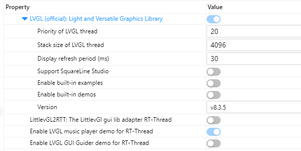

# RA6M3-HMI-Board-lvgl  参考设计说明文档

本设计是在 HMI-Board 开发板上运行的 LVGL 音乐播放器 Demo。基于 RT-Thread 操作系统，支持 RT-Thread Studio/MDK5 软件开发环境。HMI-Board 中控芯片为 RA6M3，支持 2D加速、JPEG 编解码、2M Flash 大容量存储控件，助力用户开发炫酷的图形应用。本参考设计默认运行的是 LVGL 音乐播放器，拥有绚丽的音乐播放界面，并且，通过主界面的播放/暂停、上一首/下一首按钮控件，可以对音乐播放器进行播放控制。用户可以凭借此参考设计评估 RA6M3 芯片的图形性能。

本文档包括技术架构、使用说明、资料及文档三部分内容，通过阅读理解本篇内容，可在此参考设计基础上进行二次开发。

## 技术架构

HMI-Board-LVGL 开发框架包括系统层、框架层、应用层三个主要层级：

### 系统层 System Layer

RT-Thread 是开源国产物联网操作系统，它是一个嵌入式实时多线程操作系统。它集成了大量的系统级基础组件，丰富的软件包，以及详尽的开发指导文档，具体包括：

- 内核层：RT-Thread 内核，是 RT-Thread 的核心部分，包括了内核系统中对象的实现，例如多线程及其调度、信号量、邮箱、消息队列、内存管理、定时器等；libcpu/BSP（芯片移植相关文件 / 板级支持包）与硬件密切相关，由外设驱动和 CPU 移植构成。
- 组件与服务层：组件是基于 RT-Thread 内核之上的上层软件，例如虚拟文件系统、FinSH 命令行界面、网络框架、设备框架等。采用模块化设计，做到组件内部高内聚，组件之间低耦合。
- RT-Thread 软件包：运行于 RT-Thread 物联网操作系统平台上，面向不同应用领域的通用软件组件，由描述信息、源代码或库文件组成。

### 组件层 Component Layer

除了系统层支持外，HMI-Board 还集成了多个出色的系统组件，其中 LVGL 作为多媒体组件加入到了本示例项目中。开发者只需要在 RT-Thread Studio/env 中使能 LVGL 软件包，并将其从服务器上拉取下来，便可以将 LVGL 以组件的形式加入到开发项目中。极大的简化了开发者手动将其加入项目中的步骤，提升效率。

### 应用层 Application Layer

应用层为用户在 LVGL 上进行 UI 的二次开发所使用的，用户可以已有/开发的 UI 代码写在 APP 层级。

音乐播放器 DEMO：

通过播放/暂停、上一首/下一首按钮控件，在触摸面板上可以对音乐播放器进行控制。通过上拉面板控件可以查看音乐列表。也可也在代码中修改手动播放为自动播放。

## 使用说明

在 RT-Thread Studio 中可以选择基于示例工程创建 LVGL-Demo。工程创建成功后，进行编译烧录即可。

> RT-Thread Studio 的安装使用说明：[快速开始](https://www.rt-thread.org/document/site/#/development-tools/rtthread-studio/um/studio-user-begin)

图中为 LVGL 软件包在 RT-Thread 中的集成形式，用户可以通过图形化方式对 LVGL 进行配置：

## 资料及文档

用户如果希望自行移植 LVGL，可以在 RT-Thread 文档中心查看移植相关文档和视频教程：

- [LVGL的对接与移植](https://www.rt-thread.org/document/site/#/rt-thread-version/rt-thread-standard/packages-manual/lvgl-docs/introduction)

如要进行 LVGL UI 开发可以前往 LVGL 官网以及文档中心获取详细资料：

- [LVGL - Light and Versatile Embedded Graphics Library](https://lvgl.io/)

- [LVGL documentation](https://docs.lvgl.io/8.3/)